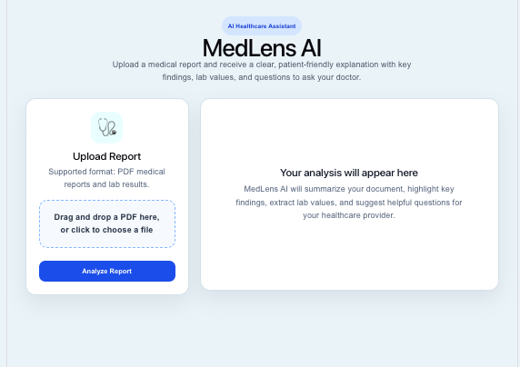
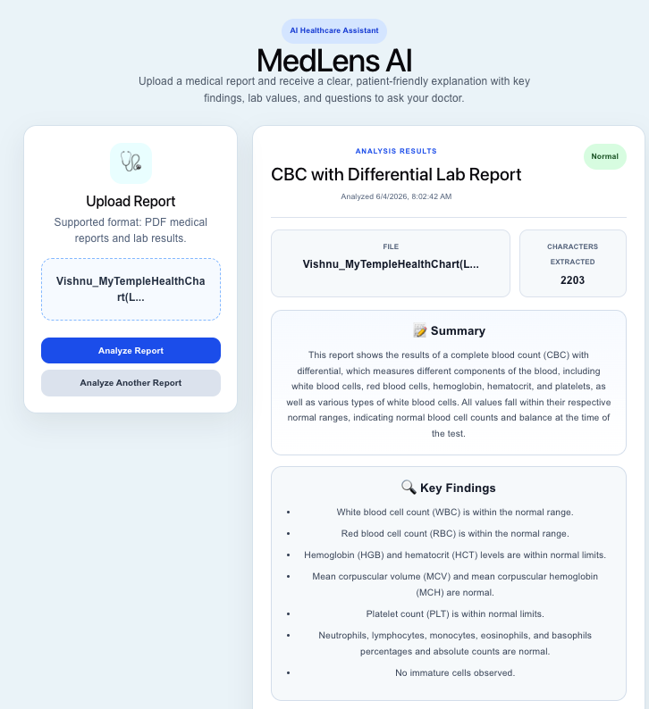
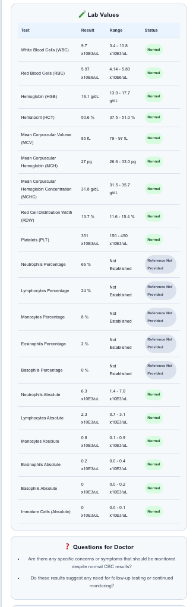
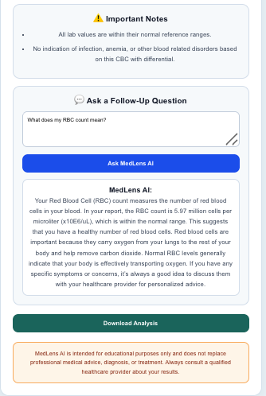

# MedLens AI

MedLens AI is an AI-powered healthcare application that helps patients better understand medical reports by converting complex medical terminology into clear, patient-friendly explanations.

The platform analyzes uploaded medical reports, extracts key findings and laboratory values, generates questions for healthcare providers, and provides AI-powered follow-up explanations to help patients make more informed healthcare decisions.

---

## Problem

Medical reports often contain technical terminology, laboratory measurements, and clinical language that can be difficult for patients to understand.

As a result, many patients leave appointments uncertain about their results and unsure of what questions to ask their healthcare providers.

MedLens AI was developed to bridge this gap by transforming complex medical information into accessible, understandable insights.

---

## Features

### Medical Report Upload

- Upload PDF medical reports and laboratory results
- Automatic document processing and text extraction

### AI-Powered Analysis

- Document type identification
- Plain-English report summaries
- Key findings extraction
- Important notes and observations

### Laboratory Value Analysis

- Extract laboratory measurements
- Display reference ranges when available
- Highlight abnormal or noteworthy results
- Transparent handling of missing reference ranges

### Questions for Doctor

- Automatically generates suggested questions patients may wish to discuss with healthcare providers

### Follow-Up AI Assistant

- Ask questions about report results
- Receive patient-friendly explanations using report context

### Downloadable Analysis

- Export generated report summaries for future reference

---

## Screenshots

### Upload Interface



### AI Analysis Overview



### Laboratory Value Extraction



### Follow-Up AI Assistant



---

## Technology Stack

### Frontend

- React
- Vite
- Axios
- CSS

### Backend

- FastAPI
- Python

### AI & NLP

- OpenAI API

### Document Processing

- PDFPlumber
- JSON Data Processing

---

## Architecture

```text
PDF Upload
    ↓
PDF Text Extraction
    ↓
AI Analysis Engine
    ↓
Structured Medical Insights
    ↓
Interactive Patient Dashboard
```

---

## Future Improvements

- OCR support for scanned medical documents
- User authentication and secure accounts
- Historical report storage
- Trend analysis across multiple reports
- Cloud deployment
- Advanced medical document classification

---

## Demo Video

YouTube Demo:

[Watch Demo Video](https://youtu.be/o81bjVsvE8M)

---

## Disclaimer

MedLens AI is intended for educational purposes only and does not replace professional medical advice, diagnosis, or treatment. Always consult a qualified healthcare provider regarding medical concerns and test results.

---

## Author

**Vishnu Pillai**

Built as a hackathon project focused on improving healthcare accessibility through artificial intelligence.
